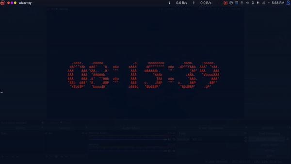

Digital Watch of 24 hr.
-------------------------
This is simple project. (for beginner)
written in ' C ' by me without any graphic library.
For those people who want to make project and they Only know to create application in console ;)
It helps people to improve him/her creativity in console application.

NOTE
----- 
it only work properly in linux machine because of "ASCII escape charector" used in programe. Some escape charectors are not work same in both plateform.

compilation
------------

On linux
--------
To Run in terminal 
NOTE -- see directory are same( where file is located ) otherwise won't compile

Command for Running in linux terminal :-
 
>>> " make " 

>>> ./RunMe   (to see output)

On windows
----------
just compile main.c
but not expect proper output (it won't give compilation error)

Sample Output
-------------

